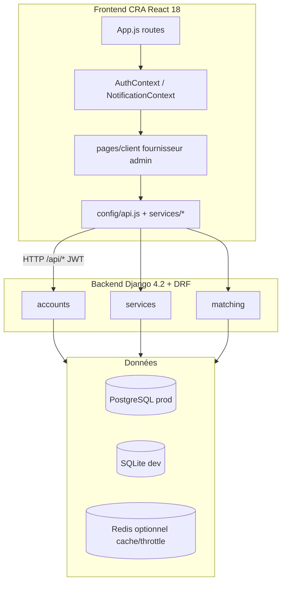
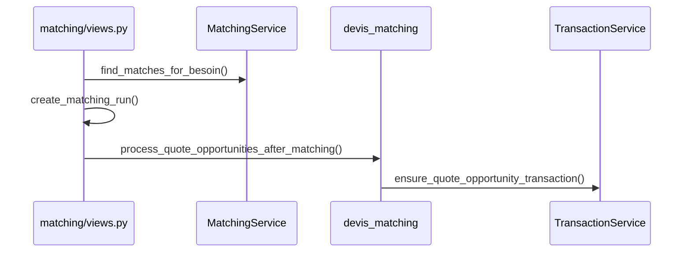

# Guide développeur

Documentation technique pour contribuer au projet **AppName** — plateforme de mise en relation clients / fournisseurs.

---

## Sommaire

1. [Vue d’ensemble](#1-vue-densemble)
2. [Prérequis et démarrage](#2-prérequis-et-démarrage)
3. [Structure du dépôt](#3-structure-du-dépôt)
4. [Backend Django](#4-backend-django)
5. [Frontend React](#5-frontend-react)
6. [Authentification et sécurité](#6-authentification-et-sécurité)
7. [API REST — cartographie](#7-api-rest--cartographie)
8. [Matching et devis (cœur métier)](#8-matching-et-devis-cœur-métier)
9. [Tests](#9-tests)
10. [Déploiement](#10-déploiement)
11. [Conventions de code](#11-conventions-de-code)
12. [Recettes courantes](#12-recettes-courantes)
13. [Dépannage](#13-dépannage)
14. [Documentation associée](#14-documentation-associée)

---

## 1. Vue d’ensemble



| Couche | Stack |
|--------|--------|
| Frontend | React 18, React Router 6, Tailwind 3, Recharts, CRA |
| Backend | Django 4.2.7, DRF 3.14, SimpleJWT, django-filter, django-environ |
| Auth | JWT (`access` + `refresh`), rôle `type_utilisateur` |
| BDD dev | SQLite (`backend/db.sqlite3`) |
| BDD prod | PostgreSQL via `DATABASE_URL` |
| Serveur prod | Gunicorn + WhiteNoise + Nginx (voir `deploy/ovh/`) |

---

## 2. Prérequis et démarrage

### Prérequis

- **Python 3.10+** (testé avec 3.13)
- **Node.js** LTS + **npm**
- Git

### Backend

```bash
cd backend
python -m venv venv

# Windows
venv\Scripts\activate

# Linux / macOS
source venv/bin/activate

pip install -r requirements.txt
cp .env.example .env          # puis éditer si besoin
python manage.py migrate
python manage.py runserver    # http://127.0.0.1:8000
```

Données de démo (DEBUG uniquement) :

```bash
python manage.py seed_db
# ou
python manage.py seed_burkina_demo
```

### Frontend

```bash
cd frontend
npm install
npm start                       # http://localhost:3000
```

Le **`proxy`** dans `frontend/package.json` redirige vers `http://localhost:8000`. Les appels API utilisent donc `/api/...` sans host explicite en dev.

**Production build :** définir `REACT_APP_API_URL` (voir `frontend/.env.production.example`).

### Script Windows

```powershell
.\demarrer-local.ps1
```

---

## 3. Structure du dépôt

```
mise_en_relation/
├── backend/
│   ├── transport_platform/     # settings.py, urls racine
│   ├── accounts/               # User, JWT, profils, throttling
│   ├── services/               # Besoin, Prestation, Transaction, Message
│   ├── matching/               # Algorithme, MatchingRun, devis_matching
│   ├── manage.py
│   ├── requirements.txt
│   └── .env.example
├── frontend/
│   ├── src/
│   │   ├── App.js              # Routes
│   │   ├── config/api.js       # API_ENDPOINTS
│   │   ├── contexts/           # Auth, Notifications
│   │   ├── services/           # Couche API métier
│   │   ├── pages/              # client | fournisseur | administrateur
│   │   ├── components/         # Layout, Header, auth…
│   │   └── utils/              # tarification.js, api.js, …
│   └── package.json
├── deploy/ovh/                 # VPS : nginx, gunicorn, scripts
├── docs/                       # Guides utilisateur + technique
├── README.md
└── PROMPTS_ET_REFERENCE.md     # Repères rapides / prompts IA
```

---

## 4. Backend Django

### Applications

| App | Responsabilité | Fichiers clés |
|-----|----------------|---------------|
| **accounts** | User custom, login/register, profils client/fournisseur | `models.py`, `views.py`, `authentication.py`, `permissions.py`, `throttling.py` |
| **services** | Catalogue, besoins, prestations, transactions, messages, admin API | `models.py`, `views.py`, `serializers.py`, `admin_views.py`, `specific_views.py` |
| **matching** | Scoring, runs, correspondances, flux devis | `services.py`, `views.py`, `utils.py`, `devis_matching.py` |

### Modèles métier principaux (`services/models.py`)

| Modèle | Rôle |
|--------|------|
| `CategorieService` / `SousCategorieService` | Taxonomie |
| `Besoin` | Demande client (`mode_budget`, `budget`, `statut`) |
| `Prestation` | Offre fournisseur (`mode_tarification`, `tarif_min/max`) |
| `TransactionService` | Collaboration + champs `devis_*`, workflow travail |
| `Message` | Messagerie (option pièce jointe) |

Alias legacy : `Demande = Besoin`, `ServiceOffer = Prestation` — préférer les noms français dans le nouveau code.

### Matching — persistance

- **`MatchingRun`** : une exécution = une ligne + JSON `correspondances[]`
- **`merge_effective_correspondances()`** (`matching/utils.py`) : dernière version par paire `(besoin_id, prestation_id)`
- Référence admin : **`corr_ref`** = `"<run_id>:<index>"`

### Permissions

- Défaut DRF : `IsAuthenticated`
- Rôles : `IsClientProvider`, `IsServiceProvider`, `IsAdministrator` (`accounts/permissions.py`)
- Champ utilisateur : **`type_utilisateur`** (`client` | `fournisseur` | `administrateur`)
- Propriété **`user_type`** : alias de `type_utilisateur` (legacy)

### Variables d’environnement (`backend/.env`)

| Variable | Description |
|----------|-------------|
| `SECRET_KEY` | Clé Django (obligatoire en prod) |
| `DEBUG` | `True` / `False` |
| `ALLOWED_HOSTS` | Domaines autorisés |
| `DATABASE_URL` | PostgreSQL en prod |
| `CORS_ALLOWED_ORIGINS` | Origines front autorisées |
| `CORS_ALLOW_ALL_ORIGINS` | `False` en prod |
| `JWT_ACCESS_TOKEN_LIFETIME` | Minutes (défaut 60) |
| `JWT_REFRESH_TOKEN_LIFETIME` | Minutes (défaut 1440) |
| `THROTTLE_*` | Rate limiting (voir §6) |
| `REDIS_URL` | Cache partagé + Celery (optionnel) |

Référence complète : `backend/.env.example`.

### Migrations

```bash
python manage.py makemigrations
python manage.py migrate
python manage.py showmigrations
```

---

## 5. Frontend React

### Routing (`src/App.js`)

- **Public** : `/`, `/login`, `/register`, `/services`
- **Client** : `/client/*` protégé par `ClientRoute`
- **Fournisseur** : `/fournisseur/*` → `FournisseurRoute`
- **Admin** : `/admin/*` → `AdministrateurRoute`
- Layout authentifié : `DashboardLayout` (TopBar + SideBar)

Menu latéral : `src/components/layout/SideBar.js` (items par `type_utilisateur`).

### État global

| Contexte | Fichier | Rôle |
|----------|---------|------|
| Auth | `contexts/AuthContext.js` | Login, register, logout, user courant |
| Notifications | `contexts/NotificationContext.js` | Polling messages + transactions |

Pas de Redux : état local dans les pages pour formulaires et listes.

### Couche API (à connaître)

| Fichier | Rôle |
|---------|------|
| `config/api.js` | Constantes **`API_ENDPOINTS`** |
| `services/apiClient.js` | `request`, `requestJson`, `fetchAllPaginated` (recommandé) |
| `services/*.js` | `adminService`, `transactionsService`, `authService`, … |
| `utils/api.js` | Ancien client avec refresh — **à unifier** (dette technique) |

Pattern dominant aujourd’hui :

```javascript
const token = localStorage.getItem('access_token');
fetch(API_ENDPOINTS.SERVICES.BESOINS, {
  headers: { Authorization: `Bearer ${token}`, 'Content-Type': 'application/json' },
});
```

Token stocké : `access_token`, `refresh_token` dans **localStorage**.

### Branding

`src/config/branding.js` — `APP_NAME`, `APP_TAGLINE`, etc.

### Utilitaires métier

- `utils/tarification.js` — libellés budget/devis, `matchRequiresQuote()`
- `utils/collaborationView.js` — helpers espace collaboration

---

## 6. Authentification et sécurité

### JWT

- Login : `POST /api/accounts/login/`
- Register : `POST /api/accounts/register/`
- Refresh : `POST /api/accounts/token/refresh/`
- Classe auth : **`LenientJWTAuthentication`** — token expiré → utilisateur anonyme (pas de 401 systématique sur routes `AllowAny`)

### Rate limiting (`accounts/throttling.py`)

| Scope | Défaut | Endpoint |
|-------|--------|----------|
| `login` | 5/min | `/api/accounts/login/` |
| `register` | 3/min | `/api/accounts/register/` |
| `token_refresh` | 10/min | `/api/accounts/token/refresh/` |
| `anon` | 100/h | Routes publiques |
| `user` | 1000/h | Routes authentifiées |

Configurable via `THROTTLE_*` dans `.env`. Avec `REDIS_URL`, compteurs partagés entre workers Gunicorn.

Réponse dépassement : **HTTP 429**.

### Checklist production

- [ ] `DEBUG=False`
- [ ] `SECRET_KEY` unique et secrète
- [ ] `CORS_ALLOW_ALL_ORIGINS=False`
- [ ] `ALLOWED_HOSTS` correct
- [ ] PostgreSQL via `DATABASE_URL`
- [ ] Pas de secrets dans Git (`deploy/ovh/GUIDE_OVH.md` : utiliser des placeholders)
- [ ] `backend/db.sqlite3` non versionné

---

## 7. API REST — cartographie

Préfixe global : **`/api/`**

### Accounts — `/api/accounts/`

| Méthode | Chemin | Auth |
|---------|--------|------|
| POST | `register/` | Public (throttled) |
| POST | `login/` | Public (throttled) |
| POST | `logout/` | JWT |
| GET/PATCH | `me/`, `profile/` | JWT |
| POST | `token/refresh/` | Public (throttled) |

### Services — `/api/services/`

| Ressource | CRUD / actions |
|-----------|----------------|
| `categories/` | Liste catégories |
| `prestations/` | CRUD + `my/`, `public/` |
| `besoins/` | CRUD + `my/` |
| `transactions/` | Liste + workflow (devis, verify, confirm, admin…) |
| `messages/` | Liste / création |
| `admin/*` | Endpoints admin (users, stats, bulk…) |

Devis :

- `POST transactions/<id>/fournisseur-propose-devis/`
- `POST transactions/<id>/client-respond-devis/`

### Matching — `/api/matching/`

| Méthode | Chemin | Rôle |
|---------|--------|------|
| POST | `trouver-correspondances/besoin/<id>/` | Lance matching pour un besoin |
| GET | `scores/` | Scores effectifs + objet `quote` |
| POST | `client/confirmer-match/` | Confirmation client |
| POST | `besoin/<id>/sync-devis-opportunities/` | Sync opportunités devis |
| POST | `admin/lancer-besoins/` | Matching admin batch |
| GET | `admin/correspondances/` | Liste groupée |
| GET | `score-debug/besoin/<b>/prestation/<p>/` | Debug scoring |

Liste complète des constantes front : `frontend/src/config/api.js`.

---

## 8. Matching et devis (cœur métier)

### Algorithme

Fichier : **`backend/matching/services.py`** — classe `MatchingService`.

Critères pondérés (extrait) : compétence, géographie, disponibilité, fiabilité, prix (~10 %), abonnement.

Score dur : compatibilité catégorie / sous-catégorie. Seuil variable par paire (`_score_threshold_for_pair`).

### Flux devis

Fichier : **`backend/matching/devis_matching.py`**

```python
match_requires_quote(besoin, prestation):
    return besoin.mode_budget == "sur_devis" or prestation.mode_tarification == "devis"
```

Après matching → `process_quote_opportunities_after_matching()` :

1. Transaction `en_attente`, `devis_statut=a_proposer`
2. Message notification au fournisseur
3. Client accepte devis → `client_confirmer_match` autorisé

Doc métier : [TARIFICATION.md](TARIFICATION.md).

### Diagramme dev



---

## 9. Tests

### Backend

```bash
cd backend
python manage.py test                           # tout
python manage.py test matching                  # app matching
python manage.py test accounts.tests            # auth + rate limit
python manage.py test matching.tests.MatchingDevisFlowTestCase -v 2
```

~40 tests backend (accounts, services, matching). **Pas de tests frontend** pour l’instant (`npm test` disponible via CRA).

### Bonnes pratiques

- Vider le cache entre tests de throttle : `cache.clear()` dans `setUp`
- Après tests matching incohérents : `python manage.py clear_matching --yes`

---

## 10. Déploiement

| Ressource | Chemin |
|-----------|--------|
| Guide OVH | `deploy/ovh/GUIDE_OVH.md` |
| Étapes simples | `deploy/ovh/ETAPES_SIMPLES.md` |
| Deploy script | `deploy/ovh/deploy-app.sh` |
| Gunicorn | `deploy/ovh/gunicorn.service` |
| Nginx | `deploy/ovh/nginx-serviceconnect.conf` |
| Procfile / build | `backend/Procfile`, `backend/build.sh` |

Workflow typique : `git push` → sur VPS `git pull` + `bash deploy/ovh/deploy-app.sh`.

**Manque actuel :** CI/CD (GitHub Actions), Docker Compose, OpenAPI.

---

## 11. Conventions de code

### Backend

- Nommage métier en **français** : `Besoin`, `Prestation`, `intitule`, `type_utilisateur`
- Vues DRF : `@api_view` ou `generics.*` ; permissions explicites sur endpoints sensibles
- Serializers dans `serializers.py` ; validation métier (ex. budget) dans serializers ou helpers
- Migrations : une app = un jeu cohérent ; ne pas éditer une migration déjà poussée en prod

### Frontend

- Pages par rôle : `pages/client/`, `pages/fournisseur/`, `pages/administrateur/`
- UI Tailwind : cartes `rounded-xl`, bordures `slate`, accent `indigo` (voir admin/client existants)
- Endpoints : toujours via **`API_ENDPOINTS`**, pas d’URL en dur
- Libellés tarification : `utils/tarification.js`

### Git

- Ne pas committer : `.env`, `db.sqlite3`, `__pycache__`, `frontend/build/`
- Commits : sujet clair, périmètre limité
- Documenter nouvelles variables env dans `.env.example`

### Dette technique connue

| Sujet | Piste |
|-------|--------|
| Double client API (`utils/api.js` vs `apiClient.js`) | Unifier + refresh centralisé |
| Routes dupliquées dans `App.js` | Nettoyer |
| Celery configuré sans `tasks.py` | Retirer ou implémenter |
| `axios` non utilisé | Retirer du `package.json` |
| Deux endpoints stats admin | Fusionner |

---

## 12. Recettes courantes

### Ajouter un endpoint API

1. Serializer + vue dans l’app concernée
2. Route dans `urls.py` de l’app
3. Constante dans `frontend/src/config/api.js`
4. Appel dans un `services/*.js` ou page
5. Test Django dans `tests.py`

### Modifier le score matching

1. `backend/matching/services.py` — méthode concernée
2. Mettre à jour `build_match_reasons()` si messages client
3. `python manage.py test matching`
4. Optionnel : `score-debug` endpoint pour valider une paire

### Ajouter une page front protégée

1. Composant dans `pages/<role>/`
2. Route dans `App.js` avec `ClientRoute` / `FournisseurRoute` / `AdministrateurRoute`
3. Entrée menu dans `SideBar.js` si besoin

### Réinitialiser les correspondances

```bash
python manage.py clear_matching --yes
```

### Créer un superuser Django (admin natif `/admin/`)

```bash
python manage.py createsuperuser
```

---

## 13. Dépannage

| Symptôme | Cause probable | Action |
|----------|----------------|--------|
| CORS / network error | Backend arrêté ou mauvaise origine | Vérifier port 8000, `CORS_*` |
| 401 sur routes protégées | Token expiré (~60 min) | Re-login |
| 429 Too Many Requests | Rate limit auth | Attendre ou ajuster `THROTTLE_*` en dev |
| Matching vide | Catégories incompatibles, besoin non `ouverte` | `score-debug`, vérifier statuts |
| Devis bloqué | `devis_statut != accepte_client` | Voir [TARIFICATION.md](TARIFICATION.md) |
| Pagination incomplète | `PAGE_SIZE=20` | `fetchAllPaginated` côté front |
| Migrations en conflit | Branches divergentes | `showmigrations`, merge manuel |

---

## 14. Documentation associée

| Document | Public |
|----------|--------|
| [README.md](../README.md) | Install rapide, commandes |
| [PROMPTS_ET_REFERENCE.md](../PROMPTS_ET_REFERENCE.md) | Repères IA / snippets |
| [GUIDE_UTILISATEURS.md](GUIDE_UTILISATEURS.md) | Index guides métier |
| [guides/GUIDE_CLIENT.md](guides/GUIDE_CLIENT.md) | Parcours client |
| [guides/GUIDE_FOURNISSEUR.md](guides/GUIDE_FOURNISSEUR.md) | Parcours fournisseur |
| [guides/GUIDE_ADMINISTRATEUR.md](guides/GUIDE_ADMINISTRATEUR.md) | Parcours admin |
| [TARIFICATION.md](TARIFICATION.md) | Budget, devis, diagrammes |

---

*Guide aligné sur la branche courante du dépôt `mise_en_relation`. Mettre à jour ce fichier lors de changements d’architecture ou de nouveaux endpoints.*
