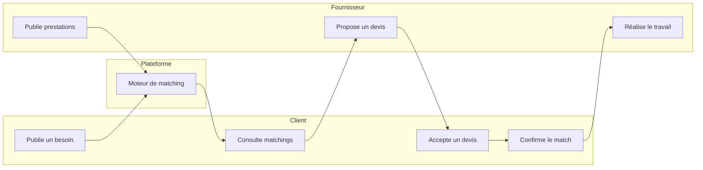

# Guides utilisateur

Documentation à destination des **utilisateurs finaux** de la plateforme **AppName** (mise en relation de services).

---

## À qui s’adresse chaque guide ?

| Guide | Profil | Rôle sur la plateforme |
|-------|--------|------------------------|
| [Guide client](guides/GUIDE_CLIENT.md) | Particulier ou entreprise | Publier un **besoin**, recevoir des **matchings**, choisir un fournisseur |
| [Guide fournisseur](guides/GUIDE_FOURNISSEUR.md) | Prestataire, artisan, PME | Publier des **prestations**, répondre aux **devis**, mener les **collaborations** |
| [Guide administrateur](guides/GUIDE_ADMINISTRATEUR.md) | Équipe plateforme | Superviser utilisateurs, **matching**, transactions, catégories |
| [Guide développeur](GUIDE_DEVELOPPEUR.md) | Développeurs | Architecture, API, setup, tests, déploiement |

---

## Documentation complémentaire

| Document | Contenu |
|----------|---------|
| [GUIDE_DEVELOPPEUR.md](GUIDE_DEVELOPPEUR.md) | Stack, structure code, API, matching, sécurité, recettes |
| [TARIFICATION.md](TARIFICATION.md) | Budget fixe, sur devis, tarification des prestations |
| [README.md](../README.md) | Installation technique, stack, commandes développeur |

---

## Accès à la plateforme

| Action | URL |
|--------|-----|
| Accueil public | `/` |
| Connexion | `/login` |
| Inscription | `/register` |
| Tableau de bord client | `/client/dashboard` |
| Tableau de bord fournisseur | `/fournisseur/dashboard` |
| Tableau de bord admin | `/admin/dashboard` |
| Page « Nos services » | `/services` |

---

## Parcours global (vue simplifiée)

---

## Notifications

La cloche en haut à droite du tableau de bord signale notamment :

- **Messages non lus**
- **Devis à valider** (client) ou **devis à proposer** (fournisseur)
- **Étapes de collaboration** (travail à vérifier, validation admin, etc.)

---

## Support

Contact : voir `APP_CONTACT_EMAIL` dans la configuration de la plateforme (`contact@appname.bf` par défaut).

---

*Dernière mise à jour : guides alignés sur les menus et routes de l’application React.*
