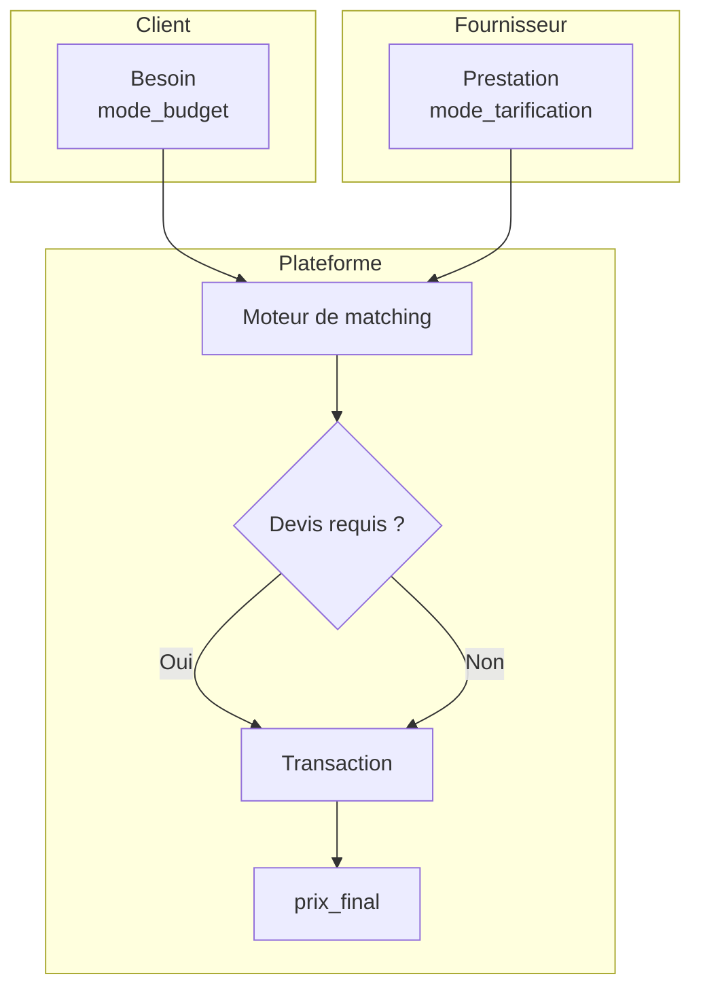
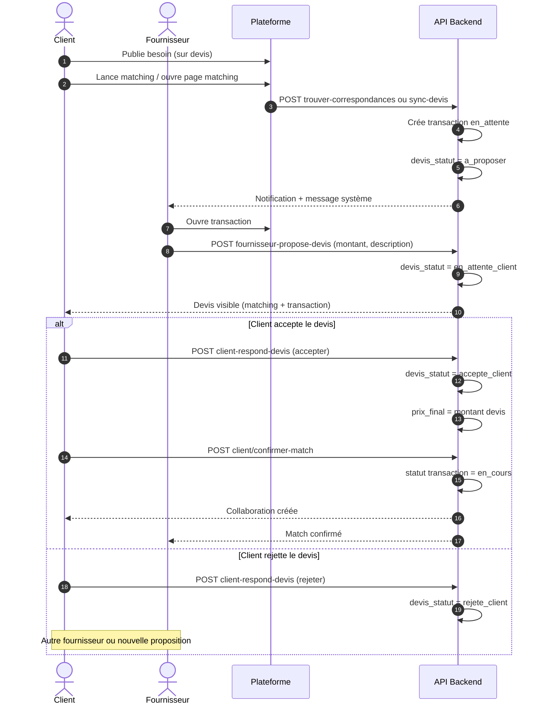
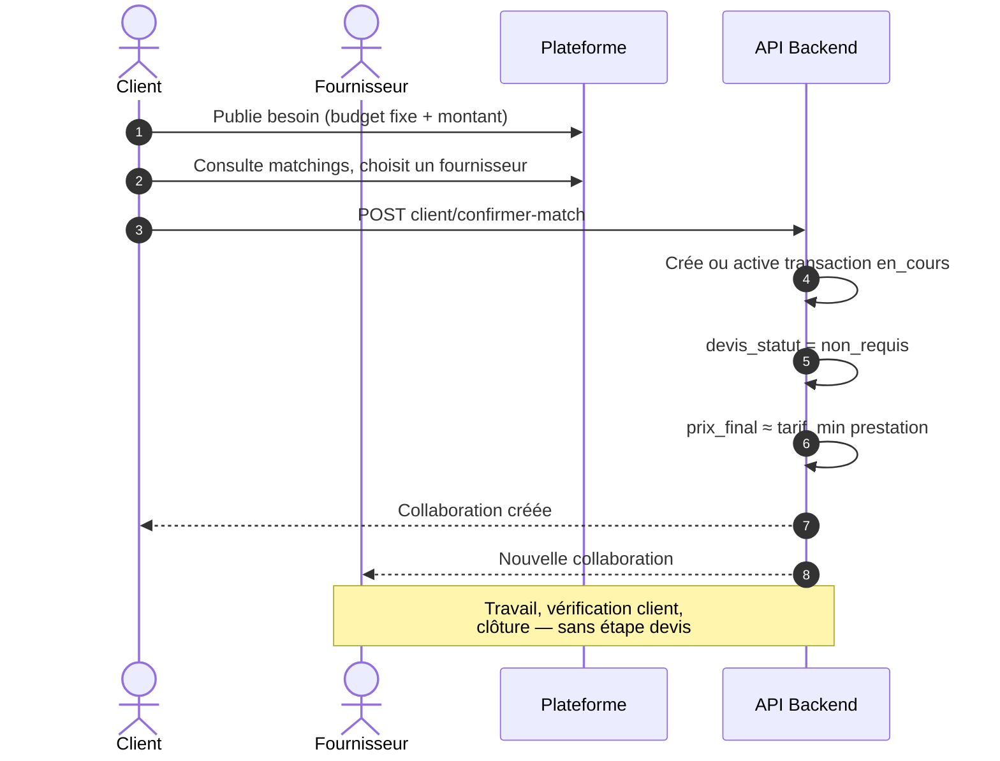
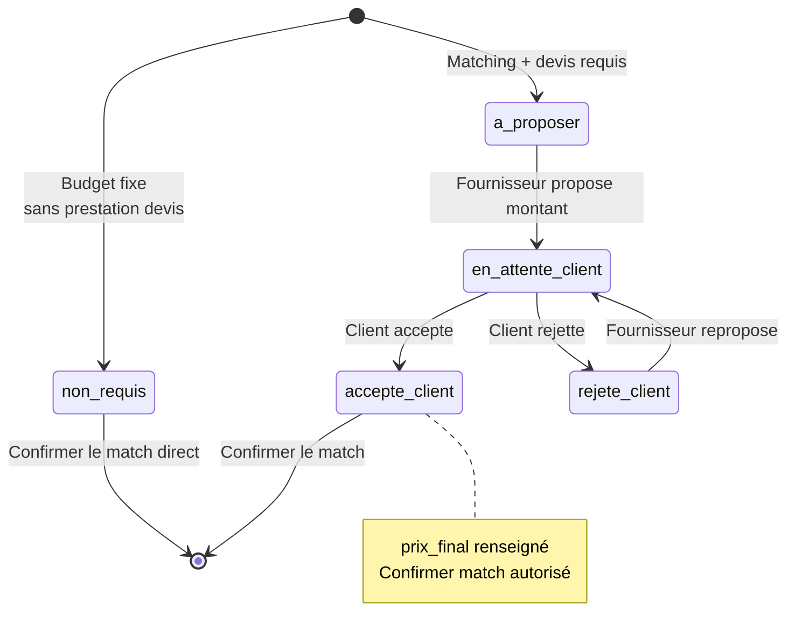

# Guide de tarification

Documentation du modèle de prix sur la plateforme de mise en relation : ce que voient les utilisateurs, ce que fait le système, et où modifier le code.

---

## Sommaire

1. [Idée générale](#1-idée-générale)
2. [Côté client : le besoin](#2-côté-client--le-besoin)
3. [Côté fournisseur : la prestation](#3-côté-fournisseur--la-prestation)
4. [Quand faut-il un devis ?](#4-quand-faut-il-un-devis-)
5. [Parcours devis, étape par étape](#5-parcours-devis-étape-par-étape) — **diagrammes de séquence**
6. [Après le match : le prix final](#6-après-le-match--le-prix-final)
7. [Matching et comparaison des prix](#7-matching-et-comparaison-des-prix)
8. [Qui fait quoi dans l’interface](#8-qui-fait-quoi-dans-linterface)
9. [Quel mode choisir selon le métier](#9-quel-mode-choisir-selon-le-métier)
10. [Référence technique](#10-référence-technique)
11. [Tests](#11-tests)
12. [Questions fréquentes](#12-questions-fréquentes)

---

## 1. Idée générale

Sur la plateforme, le prix n’est pas unique : il dépend de **qui publie quoi** et de **comment la collaboration est validée**.

| Rôle | Ce qu’il déclare | Effet principal |
|------|------------------|-----------------|
| **Client** | Mode de budget sur son **besoin** | Budget annoncé *ou* attente de devis |
| **Fournisseur** | Mode de tarification sur sa **prestation** | Forfait, à l’heure, ou sur devis |
| **Plateforme** | **Transaction** + champs devis | Prix réel et statut de la collaboration |

Le **tarif horaire** du profil fournisseur sert d’indication (fiche profil). Il n’est pas encore utilisé pour calculer automatiquement un montant sur une transaction.

> **Affichage des diagrammes** : ouvrez ce fichier avec un lecteur Markdown qui supporte **Mermaid** (Cursor, VS Code + extension Mermaid, GitHub, GitLab). En aperçu brut, vous ne verrez que le code source des diagrammes.

### Diagramme — vue d’ensemble des acteurs



---

## 2. Côté client : le besoin

Champ : `mode_budget` sur le modèle **Besoin**.

### Budget fixe (`budget_fixe`)

- Le client indique un **montant en FCFA** (obligatoire).
- Les fournisseurs sont comparés via le **score prix** du matching (budget vs fourchette de la prestation).
- **Pas de devis obligatoire** pour confirmer le match (sauf si la prestation choisie est en mode « sur devis » — voir section 4).

**Exemples :** livraison express, petit dépannage, prestation avec tarif connu.

### Sur devis (`sur_devis`)

- Le budget est **optionnel** (indication pour le matching uniquement).
- Après le matching, chaque fournisseur retenu doit **proposer un devis**.
- Le client **accepte ou rejette** chaque devis.
- La **confirmation du match** n’est possible qu’après un devis **accepté**.

**Exemples :** rénovation de boutique, installation climatisation, développement sur mesure.

**Formulaires :** `frontend/src/pages/client/besoin/BesoinCreate.js`, `BesoinEdit.js`

---

## 3. Côté fournisseur : la prestation

Champ : `mode_tarification` sur le modèle **Prestation**.

| Valeur en base | Affichage conseillé | Rôle |
|----------------|---------------------|------|
| `forfait` | Forfait (prix package) | Prix pour une prestation définie ; fourchette min/max recommandée |
| `fixe` | Forfait (ancien libellé) | Même traitement que `forfait` dans le code |
| `horaire` | À l’heure | Facturation au temps ; fourchette = estimation (pas de calcul heures × taux automatique aujourd’hui) |
| `devis` | Sur devis | Prix définitif après étude ; fourchette **indicative** seulement |

**Formulaires :** `frontend/src/pages/fournisseur/prestation/PrestationCreate.js`, `PrestationEdit.js`  
**Libellés partagés :** `frontend/src/utils/tarification.js`

---

## 4. Quand faut-il un devis ?

Le système active le **flux devis** (et bloque la confirmation du match sans devis accepté) si :

```text
besoin.mode_budget == "sur_devis"
        OU
prestation.mode_tarification == "devis"
```

| Besoin | Prestation | Devis obligatoire ? |
|--------|------------|:-------------------:|
| Budget fixe | Forfait / horaire | Non |
| Budget fixe | Sur devis | **Oui** |
| Sur devis | Forfait / horaire | **Oui** |
| Sur devis | Sur devis | **Oui** |

**En résumé :** dès que le client demande un devis *ou* que le fournisseur vend « sur devis », la plateforme impose proposition → validation → puis confirmation du match.

Code : `match_requires_quote()` dans `backend/matching/devis_matching.py` et `matchRequiresQuote()` dans `frontend/src/utils/tarification.js`.

---

## 5. Parcours devis, étape par étape

### 5.1 Déclenchement

Le devis est préparé quand :

- un **matching** est lancé (client, admin ou recalcul sur la page matching), ou
- le client ouvre la page matching et la plateforme appelle **sync devis** pour les correspondances déjà existantes.

Effets côté technique :

1. Création (ou mise à jour) d’une **transaction** en statut `en_attente`.
2. `devis_statut` = `a_proposer`.
3. **Message** au fournisseur : *« Nouvelle correspondance — devis à proposer »*.

### 5.2 Statuts du devis

| Statut | Signification | Action attendue |
|--------|---------------|-----------------|
| `non_requis` | Pas de devis pour cette collaboration | — |
| `a_proposer` | Match OK, le fournisseur n’a pas encore chiffré | Fournisseur propose un montant |
| `en_attente_client` | Devis envoyé | Client accepte ou rejette |
| `accepte_client` | Prix validé | Client peut **confirmer le match** |
| `rejete_client` | Devis refusé | Fournisseur peut en proposer un autre |

### 5.3 Diagramme de séquence — flux devis (cas principal)

Ce diagramme correspond au parcours **besoin sur devis** ou **prestation sur devis** : le client ne peut confirmer le match qu’après avoir accepté le devis.



### 5.4 Diagramme de séquence — budget fixe (sans devis)

Quand le besoin est en **budget fixe** et la prestation n’est **pas** en mode `devis`, la confirmation du match ne passe pas par l’acceptation d’un devis.



### 5.5 Diagramme d’états — statuts du devis



### 5.6 Enchaînement texte (résumé)

```text
  [Matching]
      |
      v
  Transaction en_attente + devis "à proposer"
      |
      v
  Fournisseur : montant + description  -->  "en attente client"
      |
      +-- Client accepte  -->  prix_final fixé  -->  [Confirmer le match] -->  collaboration en_cours
      |
      +-- Client rejette  -->  autre fournisseur ou nouveau devis
```

### 5.7 Où agir dans l’application

| Acteur | Écran principal |
|--------|-----------------|
| Client | Page **Matching du besoin** — bloc « Devis du fournisseur » + boutons Accepter / Rejeter |
| Client | **Transaction** `/client/transactions/<id>` — même actions |
| Fournisseur | **Transaction** `/fournisseur/transactions/<id>` — formulaire « Proposer un devis » |

---

## 6. Après le match : le prix final

Champ : `prix_final` sur **TransactionService**.

| Situation | Valeur de `prix_final` |
|-----------|------------------------|
| Budget fixe, pas de devis | Souvent `tarif_min` de la prestation à la confirmation |
| Devis accepté | Montant du devis (`devis_montant_propose`) |
| Devis en cours ou rejeté | Non figé — confirmation du match impossible si devis requis |

Le fournisseur ne peut pas déclarer le travail terminé tant que le devis requis n’est pas accepté (`fournisseur_work_done`).

---

## 7. Matching et comparaison des prix

### Diagramme de séquence — calcul du score au matching

```mermaid
sequenceDiagram
  participant MS as MatchingService
  participant B as Besoin
  participant P as Prestation

  MS->>B: Lit mode_budget, budget
  MS->>P: Lit tarif_min, tarif_max, mode_tarification
  MS->>MS: calculate_prix_score()
  alt budget renseigné et fourchette prestation
    MS-->>MS: Score 22–100 selon écart
  else besoin sur devis sans budget
    MS-->>MS: Score prix neutre (~62)
  end
  MS->>MS: Score global + seuil d'acceptation
  Note over MS: Le devis ne modifie pas ce score ;<br/>il fixe prix_final plus tard.
```

Le moteur de matching calcule un **score prix** (poids ~10 %) en comparant :

- le **budget** du besoin (si renseigné),
- la **fourchette** `tarif_min` / `tarif_max` de la prestation.

Cas particuliers :

- Besoin **sur devis** sans budget → score prix neutre ; le devis fixera le montant plus tard.
- Pas de fourchette sur la prestation → score intermédiaire.

Le devis **ne remplace pas** ce score au moment du matching : il sert à fixer le **prix final** avant engagement.

---

## 8. Qui fait quoi dans l’interface

### Client

1. Créer un besoin → choisir **Budget fixe** ou **Sur devis**.
2. Consulter les **matchings** → comparer scores, devis, profils.
3. Si devis requis : attendre la proposition, **accepter**, puis **Confirmer le match**.
4. Suivre la collaboration dans **Mes collaborations** / transactions.

### Fournisseur

1. Publier des prestations avec le bon **mode de tarification**.
2. Recevoir une notification **Proposer un devis** (ou message dédié).
3. Saisir montant et description sur la **transaction**.
4. Après acceptation client, le client confirme le match ; la prestation passe en collaboration active.

### Administrateur

- Lance le matching sur un ou plusieurs besoins : les opportunités devis sont créées automatiquement pour les besoins **sur devis**.

---

## 9. Quel mode choisir selon le métier

| Type de service | Besoin conseillé | Prestation conseillée |
|-----------------|------------------|------------------------|
| Livraison, course, petit service | Budget fixe | Forfait |
| BTP, rénovation, gros œuvre | Sur devis | Sur devis |
| Site web, application, ERP | Sur devis | Sur devis (fourchette indicative) |
| Maintenance récurrente | Budget fixe (forfait mensuel) | Forfait |
| Dépannage / intervention courte | Budget fixe | Forfait |
| Conseil, support ponctuel | Budget fixe ou sur devis | À l’heure (estimation) |

---

## 10. Référence technique

### API principales

| Action | Méthode | Chemin |
|--------|---------|--------|
| Lancer matching + devis | POST | `/api/matching/trouver-correspondances/besoin/<id>/` |
| Synchroniser devis existants | POST | `/api/matching/besoin/<id>/sync-devis-opportunities/` |
| Liste scores + objet `quote` | GET | `/api/matching/scores/` |
| Confirmer le match | POST | `/api/matching/client/confirmer-match/` |
| Proposer un devis | POST | `/api/services/transactions/<id>/fournisseur-propose-devis/` |
| Répondre au devis | POST | `/api/services/transactions/<id>/client-respond-devis/` |

Corps utile pour la réponse client : `{ "decision": "accepter" }` ou `{ "decision": "rejeter" }`.

### Fichiers clés

| Sujet | Fichier |
|-------|---------|
| Règles devis au matching | `backend/matching/devis_matching.py` |
| Vues matching | `backend/matching/views.py` |
| Devis sur transaction | `backend/services/views.py` |
| Modèles | `backend/services/models.py` |
| Champs budget / tarif API | `backend/services/serializers.py` |
| Page matching client | `frontend/src/pages/client/matching/BesoinMatching.js` |
| Libellés UI | `frontend/src/utils/tarification.js` |
| Notifications | `frontend/src/services/notificationsService.js` |

### Champs transaction exposés à l’interface

- `besoin_mode_budget`
- `prestation_mode_tarification`
- `devis_statut`, `devis_montant_propose`, `devis_description`

---

## 11. Tests

### Scénario manuel

1. Client : besoin **sur devis**, statut ouvert.
2. Lancer le matching (client ou admin).
3. Fournisseur matché : transaction → proposer un devis (ex. 200 000 FCFA).
4. Client : page matching → **Accepter** → **Confirmer le match**.
5. Vérifier : statut collaboration `en_cours`, `prix_final` = 200 000.

### Tests automatiques

```bash
cd backend
python manage.py test matching.tests.MatchingDevisFlowTestCase
```

---

## 12. Questions fréquentes

**Pourquoi le bouton « Confirmer le match » reste grisé ?**  
Un devis est requis et n’est pas encore au statut `accepte_client`. Acceptez d’abord le devis du fournisseur choisi.

**J’ai mis un budget fixe mais la prestation est « sur devis » — que se passe-t-il ?**  
Le flux devis s’applique quand même : la prestation impose un chiffrage fournisseur avant engagement.

**Où modifier les textes affichés (Budget fixe, Sur devis, etc.) ?**  
`frontend/src/utils/tarification.js` — constantes `MODE_BUDGET_LABELS`, `MODE_TARIFICATION_LABELS`, `DEVIS_STATUT_LABELS`.

**Le mode horaire calcule-t-il heures × tarif ?**  
Pas encore. Seule une fourchette min/max sur la prestation et le `tarif_horaire` profil sont affichés. Une évolution possible : champ « durée estimée » sur le besoin.

**Différence entre `fixe` et `forfait` ?**  
Aucune dans le moteur actuel ; privilégier **forfait** dans les nouveaux formulaires. `fixe` reste pour les anciennes données.

---

*Document : modèle hybride (budget fixe + sur devis) et flux devis avant confirmation du matching.*
