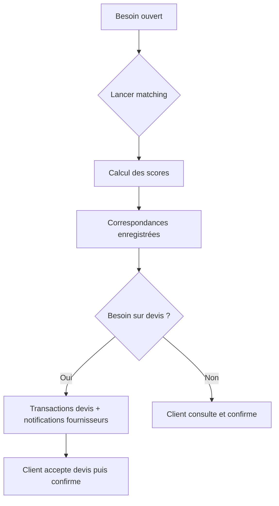

# Guide utilisateur — Administrateur

Vous êtes **administrateur** : vous pilotez la plateforme, lancez le **matching**, supervisez **utilisateurs**, **transactions** et **catégories**.

---

## Sommaire

1. [Accès et connexion](#1-accès-et-connexion)
2. [Naviguer dans l’interface](#2-naviguer-dans-linterface)
3. [Tableau de bord](#3-tableau-de-bord)
4. [Gérer les utilisateurs](#4-gérer-les-utilisateurs)
5. [Catégories et catalogue](#5-catégories-et-catalogue)
6. [Prestations et besoins](#6-prestations-et-besoins)
7. [Matching et correspondances](#7-matching-et-correspondances)
8. [Transactions et collaborations](#8-transactions-et-collaborations)
9. [Messages et paramètres](#9-messages-et-paramètres)
10. [Bonnes pratiques](#10-bonnes-pratiques)

---

## 1. Accès et connexion

- Compte avec `type_utilisateur = administrateur`
- Connexion : `/login`
- Tableau de bord : `/admin/dashboard`

Les comptes administrateur sont créés en base ou via commandes de seed (environnement de démonstration uniquement).

---

## 2. Naviguer dans l’interface

| Menu | Chemin | Rôle |
|------|--------|------|
| Tableau de bord | `/admin/dashboard` | KPI, graphiques, activité |
| Utilisateurs | `/admin/users` | Clients, fournisseurs, admins |
| Catégories | `/admin/categories` | Arborescence services |
| Prestations & Besoins | `/admin/prestations` ou `/admin/besoins` | Vue globale offres / demandes |
| Collaborations | `/admin/collaborations` | Projets client ↔ fournisseur |
| Transactions | `/admin/transactions` | Suivi financier et statuts |
| Correspondances | `/admin/correspondances` | Matching, scores, lancement |
| Messages | `/admin/messages` | Modération / support |
| Paramètres | `/admin/settings` | Configuration plateforme |

---

## 3. Tableau de bord

**Chemin :** `/admin/dashboard`

Vous y consultez typiquement :

- Nombre d’utilisateurs, besoins, prestations
- Transactions en cours ou en attente de validation
- Graphiques d’activité (Recharts)
- Raccourcis vers les sections de gestion

Utilisez-le pour **prioriser** : besoins sans matching, validations en attente, pics d’inscriptions.

---

## 4. Gérer les utilisateurs

**Chemin :** `/admin/users`

Actions possibles :

- Lister clients, fournisseurs, administrateurs
- Filtrer par type et statut (actif / inactif)
- Consulter les profils (coordonnées, date d’inscription)
- Activer ou désactiver un compte si l’interface le permet

**Bonnes pratiques :**

- Vérifier les **fournisseurs** signalés ou non vérifiés (`est_verifie`)
- Ne pas partager les identifiants admin ; un compte par personne

---

## 5. Catégories et catalogue

**Chemin :** `/admin/categories`

Structure :

- **Catégorie** (ex. BTP, Transport, Digital)
- **Sous-catégorie** (ex. Plomberie, Livraison, Développement web)

Les clients et fournisseurs choisissent ces libellés lors de la création besoin / prestation. Des catégories cohérentes améliorent la **qualité du matching**.

---

## 6. Prestations et besoins

**Chemins :** `/admin/prestations`, `/admin/besoins`

Vue d’ensemble de toutes les **offres** (prestations) et **demandes** (besoins) de la plateforme.

Utilisations :

- Contrôle qualité des annonces (descriptions, statuts)
- Identifier les besoins **ouvertes** sans fournisseur
- Repérer les prestations **inactives** ou obsolètes

---

## 7. Matching et correspondances

**Chemin principal :** `/admin/correspondances`  
**Détail par besoin :** `/admin/correspondances/besoin/<besoinId>`

### Rôle du matching

Le moteur associe chaque **besoin** aux **prestations** compatibles et calcule un **score** (compétence, zone, prix, fiabilité, etc.).

### Actions administrateur

| Action | Effet |
|--------|--------|
| Lancer matching (besoins sélectionnés ou tous ouverts) | Crée / met à jour les correspondances |
| Lancer matching besoins sans correspondance | Traite uniquement les besoins jamais matchés |
| Consulter une correspondance | Score, détails, raisons |
| Supprimer une correspondance | Retire une paire besoin ↔ prestation |

### Effet sur les devis

Pour les besoins **sur devis** (ou prestations **sur devis**), le lancement du matching :

1. Crée des **transactions** en attente (`devis_statut = a_proposer`)
2. Envoie une **notification** aux fournisseurs concernés

Voir [TARIFICATION.md](../TARIFICATION.md) pour le détail du flux.

---

## 8. Transactions et collaborations

### Transactions — `/admin/transactions`

Suivi de toutes les collaborations financières :

| Statut | Signification |
|--------|---------------|
| En attente | Opportunité devis ou match non confirmé |
| Acceptée | Devis accepté, en attente de démarrage |
| En cours | Prestation en réalisation |
| Terminée | Clôturée |
| Annulée | Sans suite |

Champs devis : montant proposé, statut (`a_proposer`, `en_attente_client`, `accepte_client`, etc.).

**Validation administrateur :** certaines transactions passent par une étape de **validation admin** (`validation_admin_statut = en_attente`) — à traiter depuis cette interface ou l’espace collaboration.

### Collaborations — `/admin/collaborations`

Vue projet par projet. Espace dédié :

`/admin/collaborations/<id>/workspace`

Permet de suivre messages, devis et avancement comme le client et le fournisseur.

---

## 9. Messages et paramètres

### Messages — `/admin/messages`

Consultation des échanges pour **support** ou **modération** (litiges, contenu inapproprié).

### Paramètres — `/admin/settings`

Configuration générale de la plateforme (selon les options implémentées dans l’interface).

---

## 10. Bonnes pratiques

### Matching

1. Lancer le matching après qu’un client a publié un besoin **complet** (catégorie, lieu, description).
2. Vérifier les **scores faibles** : parfois un mauvais choix de catégorie côté client.
3. Relancer périodiquement pour les **nouveaux fournisseurs** inscrits.

### Qualité de service

- Encourager les fournisseurs à **compléter leur profil** et à répondre aux devis sous 48 h.
- Encourager les clients à choisir le bon **mode de prix** (budget fixe vs sur devis).

### Sécurité

- Ne pas utiliser les comptes demo en production.
- Changer les mots de passe par défaut.
- Limiter le nombre de comptes administrateur.

### Litiges

1. Consulter la **transaction** et l’**espace collaboration**
2. Lire l’historique **messages**
3. Vérifier le statut **devis** et **validation client**
4. Trancher ou demander une **validation admin** si le workflow le prévoit

---

## Référence rapide des statuts devis

| Statut | Signification |
|--------|---------------|
| `a_proposer` | Fournisseur doit chiffrer |
| `en_attente_client` | Client doit accepter / rejeter |
| `accepte_client` | Client peut confirmer le match |
| `rejete_client` | Devis refusé |
| `non_requis` | Parcours sans devis |

---

[← Retour à l’index des guides](../GUIDE_UTILISATEURS.md) · [Tarification](../TARIFICATION.md)
