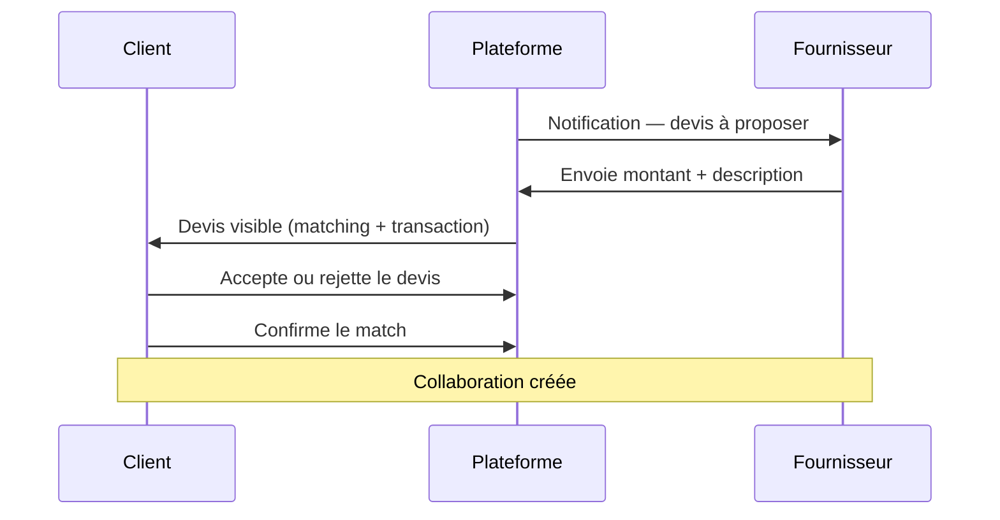

# Guide utilisateur — Client

Vous êtes **client** : vous publiez un **besoin** (travaux, service, livraison…) et la plateforme vous propose des **fournisseurs compatibles**.

---

## Sommaire

1. [Créer votre compte](#1-créer-votre-compte)
2. [Naviguer dans l’interface](#2-naviguer-dans-linterface)
3. [Publier un besoin](#3-publier-un-besoin)
4. [Comprendre le matching](#4-comprendre-le-matching)
5. [Devis et confirmation du fournisseur](#5-devis-et-confirmation-du-fournisseur)
6. [Collaboration et suivi](#6-collaboration-et-suivi)
7. [Messages et notifications](#7-messages-et-notifications)
8. [Questions fréquentes](#8-questions-fréquentes)

---

## 1. Créer votre compte

1. Allez sur **Inscription** (`/register`).
2. Choisissez le profil **Client**.
3. Renseignez nom, e-mail, téléphone et mot de passe.
4. Connectez-vous via **Connexion** (`/login`).

Après connexion, vous arrivez sur le **tableau de bord** : `/client/dashboard`.

---

## 2. Naviguer dans l’interface

Menu latéral (client) :

| Menu | Chemin | Usage |
|------|--------|--------|
| Tableau de bord | `/client/dashboard` | Vue d’ensemble, raccourcis |
| Mes besoins | `/client/mes-besoins` | Liste et détail de vos demandes |
| Mes matchings | `/client/matchings` | Besoins avec correspondances |
| Mes collaborations | `/client/mes-collaborations` | Projets en cours avec un fournisseur |
| Transactions | `/client/transactions` | Suivi financier et devis |
| Messages | `/client/messages` | Échanges avec les fournisseurs |
| Profil | `/client/profil` | Coordonnées et préférences |

---

## 3. Publier un besoin

**Chemin :** `/client/creer-besoin` (ou bouton **Créer un besoin** depuis le tableau de bord).

### Informations à préparer

- **Intitulé** et **description** clairs
- **Catégorie** et **sous-catégorie** (ex. BTP → Plomberie)
- **Lieu d’intervention**
- **Date souhaitée** et **urgence**
- **Mode de prix** (voir ci-dessous)

### Mode de prix du besoin

| Choix | Quand l’utiliser |
|-------|------------------|
| **Budget fixe** | Vous connaissez votre budget (montant obligatoire en FCFA) |
| **Sur devis** | Le prix sera proposé par le(s) fournisseur(s) après étude |

Détails complets : [TARIFICATION.md](../TARIFICATION.md).

### Statuts d’un besoin

| Statut | Signification |
|--------|---------------|
| Ouverte | Visible pour le matching |
| En cours | Un fournisseur a été retenu, collaboration active |
| Pourvue | Besoin satisfait |
| Annulée | Besoin clos sans suite |

---

## 4. Comprendre le matching

Le **matching** compare votre besoin aux **prestations** des fournisseurs (compétence, zone, disponibilité, budget, etc.) et produit un **score** sur 100.

### Consulter vos matchings

1. **Mes matchings** → `/client/matchings`
2. Ou depuis un besoin : **Voir le matching** → `/client/besoins/<id>/matching`

### Page matching d’un besoin

Vous y voyez :

- La liste des **fournisseurs** proposés, triés par score
- Le **tarif indicatif** de chaque prestation
- La colonne **Devis** (si applicable)
- Les **raisons** du matching (pourquoi ce fournisseur est suggéré)

Actions possibles :

- **Contacter** le fournisseur (message)
- **Voir le profil** du fournisseur
- **Recalculer** le matching (bouton sur la page)

> Le matching peut aussi être lancé par l’**administrateur** de la plateforme. Vous recevrez alors des correspondances sans action de votre part.

---

## 5. Devis et confirmation du fournisseur

### Quand un devis est-il nécessaire ?

Un devis est requis si :

- votre besoin est en **Sur devis**, **ou**
- la prestation du fournisseur est en mode **Sur devis**.

### Étapes (besoin sur devis)

1. **Attendez** la proposition du fournisseur (statut *Devis à proposer*).
2. Sur la page **matching** ou **Transaction**, consultez le **montant** et la **description**.
3. Cliquez sur **Accepter le devis** ou **Rejeter**.
4. Une fois le devis **accepté**, le bouton **Confirmer ce match** devient disponible.
5. Confirmez → la **collaboration** démarre.

⚠️ Sans devis accepté, vous **ne pouvez pas** confirmer le match lorsque le devis est obligatoire.

### Besoin en budget fixe (sans devis)

1. Comparez les correspondances.
2. Contactez le fournisseur si besoin.
3. **Confirmez le match** directement depuis la page matching.

---

## 6. Collaboration et suivi

Après confirmation du match :

| Écran | Chemin | Rôle |
|-------|--------|------|
| Mes collaborations | `/client/mes-collaborations` | Liste des projets actifs |
| Espace collaboration | `/client/collaborations/<id>/workspace` | Messages, devis, pièces jointes |
| Transaction | `/client/transactions/<id>` | Statut, vérification du travail |

### Cycle type d’une collaboration

1. Match confirmé → transaction **en cours**
2. Le fournisseur réalise le travail et le **déclare terminé**
3. Vous **vérifiez** le travail (validation client)
4. Si nécessaire : **validation administrateur**
5. Transaction **terminée**

---

## 7. Messages et notifications

- **Cloche** (en haut) : devis à valider, messages non lus, actions en attente.
- **Messages** (`/client/messages`) : fil de discussion avec les fournisseurs.
- Vous pouvez aussi écrire depuis la page **matching** (bouton Contacter).

---

## 8. Questions fréquentes

**Je ne vois aucun matching pour mon besoin.**  
Vérifiez que le besoin est **ouverte**, que la catégorie et le lieu sont renseignés, et demandez à l’administrateur de lancer le matching si besoin.

**Pourquoi le bouton « Confirmer le match » est grisé ?**  
Un **devis accepté** est requis. Acceptez d’abord le devis du fournisseur choisi.

**Puis-je modifier un besoin déjà publié ?**  
Oui tant qu’il n’est pas engagé en collaboration : **Mes besoins** → détail → **Modifier** (`/client/besoins/<id>/edit`).

**Puis-je comparer plusieurs devis ?**  
Oui : chaque fournisseur matché peut proposer un devis. Comparez montants et descriptions sur la page matching avant de choisir.

**Où voir le prix final ?**  
Dans la **transaction** : montant du devis accepté ou budget retenu à la confirmation.

---

[← Retour à l’index des guides](../GUIDE_UTILISATEURS.md) · [Tarification](../TARIFICATION.md)
