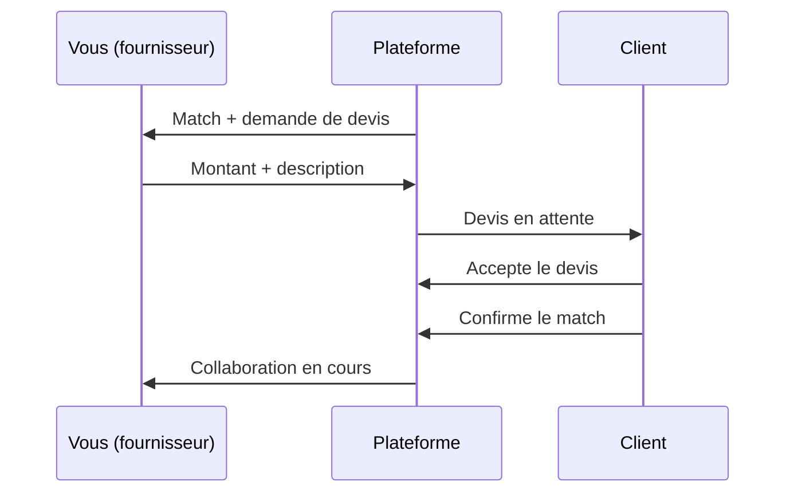

# Guide utilisateur — Fournisseur

Vous êtes **fournisseur** : vous publiez des **prestations** (offres de service) et répondez aux **besoins** des clients matchés avec votre profil.

---

## Sommaire

1. [Créer votre compte](#1-créer-votre-compte)
2. [Naviguer dans l’interface](#2-naviguer-dans-linterface)
3. [Compléter votre profil](#3-compléter-votre-profil)
4. [Publier une prestation](#4-publier-une-prestation)
5. [Recevoir des opportunités (matching)](#5-recevoir-des-opportunités-matching)
6. [Proposer un devis](#6-proposer-un-devis)
7. [Collaboration et livraison](#7-collaboration-et-livraison)
8. [Messages et notifications](#8-messages-et-notifications)
9. [Questions fréquentes](#9-questions-fréquentes)

---

## 1. Créer votre compte

1. Allez sur **Inscription** (`/register`).
2. Choisissez le profil **Fournisseur**.
3. Renseignez vos informations et connectez-vous (`/login`).

Tableau de bord : `/fournisseur/dashboard`.

---

## 2. Naviguer dans l’interface

| Menu | Chemin | Usage |
|------|--------|--------|
| Tableau de bord | `/fournisseur/dashboard` | Vue d’ensemble, activité récente |
| Mes prestations | `/fournisseur/mes-prestations` | Vos offres publiées |
| Mes collaborations | `/fournisseur/mes-collaborations` | Projets avec clients |
| Mes transactions | `/fournisseur/transactions` | Devis, statuts, paiements |
| Messages | `/fournisseur/messages` | Échanges clients |
| Profil | `/fournisseur/profil` | Raison sociale, zones, tarif horaire |

---

## 3. Compléter votre profil

**Chemin :** `/fournisseur/profil`

Renseignez notamment :

- **Raison sociale** ou nom commercial
- **Zones de couverture** (villes, quartiers)
- **Types de services** proposés
- **Années d’expérience**, certifications
- **Tarif horaire** (indication pour les clients — voir [tarification](../TARIFICATION.md))

Un profil complet améliore votre **score de fiabilité** au matching.

---

## 4. Publier une prestation

**Créer :** `/fournisseur/creer-prestation`  
**Liste :** `/fournisseur/mes-prestations`  
**Modifier :** `/fournisseur/modifier-prestation/<id>`

### Champs importants

| Champ | Conseil |
|-------|---------|
| Intitulé | Court et précis (ex. « Dépannage plomberie urgent Lomé ») |
| Description | Détaillez le périmètre, délais, garanties |
| Catégorie / sous-catégorie | Alignées sur le type de service |
| Zones d’intervention | Villes où vous intervenez |
| Disponibilités | Dates de début et fin |
| Mode de tarification | Voir tableau ci-dessous |
| Tarif min / max | Fourchette en FCFA |

### Modes de tarification

| Mode | Usage |
|------|--------|
| **Forfait** | Prix package pour une prestation définie |
| **À l’heure** | Facturation au temps (fourchette indicative) |
| **Sur devis** | Prix définitif après visite ou chiffrage |

Détails : [TARIFICATION.md](../TARIFICATION.md).

### Statuts d’une prestation

| Statut | Signification |
|--------|---------------|
| Active | Visible pour le matching |
| En cours | Liée à une collaboration |
| Terminée / Inactive | Plus proposée aux nouveaux besoins |

---

## 5. Recevoir des opportunités (matching)

Quand un **besoin client** correspond à votre prestation, la plateforme calcule un **score de compatibilité**.

Vous êtes informé par :

- **Notification** (cloche) : *Proposer un devis*
- **Message** : *Nouvelle correspondance — devis à proposer* (si devis requis)
- **Transaction** créée en statut *en attente*

Vous ne lancez pas le matching vous-même : c’est le **client** ou l’**administrateur** qui déclenche le calcul. Votre rôle est de **répondre** aux opportunités reçues.

---

## 6. Proposer un devis

### Quand proposer un devis ?

Lorsque le besoin est **sur devis** ou que votre prestation est en mode **sur devis**.

### Comment faire

1. Ouvrez **Mes transactions** → `/fournisseur/transactions`
2. Sélectionnez la transaction concernée → `/fournisseur/transactions/<id>`
3. Renseignez :
   - **Montant** (FCFA)
   - **Description** (détail du chiffrage, délais, exclusions)
4. Cliquez sur **Envoyer le devis**

Le client reçoit le devis et peut **accepter** ou **rejeter**. En cas d’acceptation, il **confirme le match** : la collaboration démarre officiellement.

### Devis rejeté

Vous pouvez **proposer un nouveau montant** depuis la même transaction (tant qu’elle n’est pas clôturée).

---

## 7. Collaboration et livraison

| Écran | Chemin |
|-------|--------|
| Collaborations | `/fournisseur/mes-collaborations` |
| Espace de travail | `/fournisseur/collaborations/<id>/workspace` |
| Transaction | `/fournisseur/transactions/<id>` |

### Étapes côté fournisseur

1. **Devis accepté** + match confirmé par le client
2. Réaliser la prestation
3. **Déclarer le travail terminé** (depuis la transaction ou l’espace collaboration)
4. Le client **vérifie** le travail
5. Si besoin : **validation administrateur**
6. Transaction **terminée**

⚠️ Vous ne pouvez pas déclarer le travail terminé si un **devis requis** n’a pas été **accepté** par le client.

---

## 8. Messages et notifications

| Notification | Action |
|--------------|--------|
| Proposer un devis | Ouvrir la transaction et chiffrer |
| Messages non lus | Répondre au client |
| Travail à déclarer | Marquer la prestation comme effectuée |
| Validation admin | Attendre la décision de l’équipe plateforme |

**Messages :** `/fournisseur/messages` — conservez un historique professionnel des échanges.

---

## 9. Questions fréquentes

**Je n’apparais dans aucun matching.**  
Vérifiez que vos prestations sont **actives**, que les **zones** et **catégories** correspondent aux besoins, et que votre profil est complet.

**Dois-je proposer un devis même si le client a indiqué un budget ?**  
Si le besoin ou votre prestation est en mode **sur devis**, oui. Sinon, le client peut confirmer le match sans étape devis.

**Puis-je avoir plusieurs prestations ?**  
Oui. Chaque prestation peut matcher des besoins différents.

**Comment modifier une prestation ?**  
**Mes prestations** → sélectionner → **Modifier** (`/fournisseur/modifier-prestation/<id>`).

**Le client n’a pas confirmé le match après mon devis.**  
Il compare peut-être d’autres fournisseurs. Relancez-le par **message** si le devis a été accepté.

---

[← Retour à l’index des guides](../GUIDE_UTILISATEURS.md) · [Tarification](../TARIFICATION.md)
